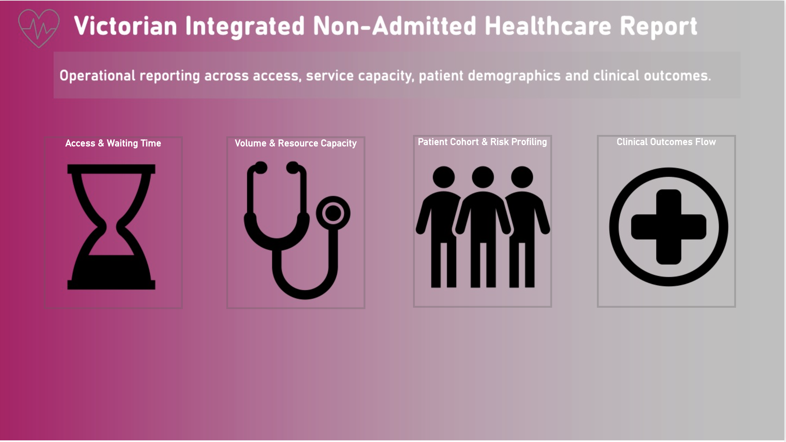

# Victorian Integrated Non-Admitted Healthcare Analytics
## Overview

Operational healthcare reporting suite built in Power BI for monitoring referral access, service capacity, patient demographics and clinical outcomes across Victorian community healthcare services.
## Dashboard Modules

- Access & Waiting Time
- Volume & Resource Capacity
- Patient Cohort & Risk Profiling
- Clinical Outcomes Flow

## Key Features
- KPI-driven operational monitoring
- Referral wait time analysis
- DNA (Did Not Attend) trend monitoring
- Healthcare equity and interpreter demand analysis
- Sankey-based clinical outcome flow analysis
- Interactive Power BI navigation experience

## Live Dashboard
https://app.powerbi.com/view?r=eyJrIjoiZTc3YWUwMWUtNzllNC00MmYyLWJkNDItZWVkZDQzNzMxMDg5IiwidCI6IjYwZDIwZjk2LTNmYWMtNDdjMy04N2FmLTE3MDE4MDNhYWJlMyJ9

## Notes

Synthetic dataset inspired by Victorian healthcare operational reporting structures.
